# AkuBook Trigger Map

> **Strategic Foundation:** Business goals connected to user psychology through driving forces

**Document:** Trigger Map Hub  
**Created:** 2026-05-12  
**Status:** COMPLETE  
**Next Phase:** UX Scenarios

---

## How to Read This Map

This Trigger Map connects **business goals** to **user psychology** through **driving forces**. It shows:

1. **Business Goals** (what we want to achieve)
2. **Target Groups** (who will help us achieve it)
3. **Driving Forces** (why they'll engage — wants & fears)
4. **Prioritization** (which goals/personas drive the flywheel)

**The Flywheel:** PRIMARY persona (Finance Admin) drives SECONDARY personas (HRD Manager) which creates TERTIARY benefits (Company Owner freedom).

---

## Visual Overview

```mermaid
graph TB
    BG0["⭐ PRIMARY GOAL<br/>95%+ Auto-Posting<br/>(THE ENGINE)"]:::primaryGoal
    BG1["🚀 SECONDARY<br/>Operational Efficiency"]:::businessGoal
    BG2["🌟 TERTIARY<br/>Business Freedom"]:::businessGoal
    
    PLATFORM["AKUBOOK<br/>All-in-One ERP"]:::platform
    
    TG1["⭐ Finance Admin<br/>(Sari, 32)"]:::targetGroup
    TG2["🚀 HRD Manager<br/>(Budi, 38)"]:::targetGroup
    TG3["🌟 Company Owner<br/>(Pak Hendra, 45)"]:::targetGroup
    
    DF1_1["✅ Eliminate Manual Entry"]:::drivingForces
    DF1_2["✅ Faster Monthly Close"]:::drivingForces
    DF1_3["✅ Single Source of Truth"]:::drivingForces
    DF1_4["❌ Migration Nightmare"]:::drivingForces
    DF1_5["❌ Learning Curve"]:::drivingForces
    DF1_6["❌ Hidden Costs"]:::drivingForces
    
    DF2_1["✅ Automated Payroll"]:::drivingForces
    DF2_2["✅ Real-Time Attendance"]:::drivingForces
    DF2_3["✅ Fast Leave Approval"]:::drivingForces
    DF2_4["❌ ZKTeco Integration"]:::drivingForces
    DF2_5["❌ Payroll Accuracy"]:::drivingForces
    DF2_6["❌ Employee Resistance"]:::drivingForces
    
    DF3_1["✅ Escape Subscription"]:::drivingForces
    DF3_2["✅ Data Sovereignty"]:::drivingForces
    DF3_3["✅ Business Intelligence"]:::drivingForces
    DF3_4["❌ Migration Nightmare"]:::drivingForces
    DF3_5["❌ Hidden Costs"]:::drivingForces
    DF3_6["❌ Vendor Dependency"]:::drivingForces
    
    BG0 --> PLATFORM
    BG1 --> PLATFORM
    BG2 --> PLATFORM
    
    PLATFORM --> TG1
    PLATFORM --> TG2
    PLATFORM --> TG3
    
    TG1 --> DF1_1
    TG1 --> DF1_2
    TG1 --> DF1_3
    TG1 --> DF1_4
    TG1 --> DF1_5
    TG1 --> DF1_6
    
    TG2 --> DF2_1
    TG2 --> DF2_2
    TG2 --> DF2_3
    TG2 --> DF2_4
    TG2 --> DF2_5
    TG2 --> DF2_6
    
    TG3 --> DF3_1
    TG3 --> DF3_2
    TG3 --> DF3_3
    TG3 --> DF3_4
    TG3 --> DF3_5
    TG3 --> DF3_6
    
    classDef primaryGoal fill:#FFD700,stroke:#333,stroke-width:3px,color:#000
    classDef businessGoal fill:#4A90E2,stroke:#333,stroke-width:2px,color:#fff
    classDef platform fill:#50C878,stroke:#333,stroke-width:2px,color:#fff
    classDef targetGroup fill:#FF6B6B,stroke:#333,stroke-width:2px,color:#fff
    classDef drivingForces fill:#95E1D3,stroke:#333,stroke-width:1px,color:#000
```

---

## Transformation Journey

**Vision:** Membebaskan bisnis Indonesia dari subscription fatigue dan vendor lock-in dengan memberikan kontrol penuh atas data dan operasi bisnis mereka melalui all-in-one ERP yang terjangkau, modular, dan dapat di-deploy on-premise.

**The Flywheel (3 Tiers):**

**⭐ PRIMARY (THE ENGINE):**
- **Finance Admin** (Sari) terbebas dari manual entry → 95%+ auto-posting achieved
- Timeline: Month 6
- **Impact:** Sari becomes strategic analyst → shares success story → drives adoption

**🚀 SECONDARY (Driven by Primary):**
- **HRD Manager** (Budi) benefits dari auto-posting engine → automated payroll < 4 jam
- **Operational efficiency** across all roles → faster monthly close, real-time visibility
- Timeline: Month 3-6
- **Impact:** Operational excellence demonstrated → companies see ROI

**🌟 TERTIARY (Benefits for Companies):**
- **Company Owner** (Pak Hendra) escapes subscription fatigue → data sovereignty, cost predictability
- **Business freedom** achieved → on-premise option, seamless migration, transparent pricing
- Timeline: Immediate to Month 12
- **Impact:** Companies choose AkuBook → word-of-mouth adoption → market expansion

---

## Business Strategy

**Primary Development Focus:**
1. **Auto-Posting Engine** (THE ENGINE) — 95%+ transactions auto-post to journal
2. **Cross-Module Integration** — Sales/Purchase/Inventory → Accounting seamless
3. **ZKTeco Integration** — Attendance auto-sync → Payroll auto-calculate
4. **Migration Wizard** — Accurate/Excel data import seamless
5. **On-Premise Deployment** — SQLite/PostgreSQL self-hosted option

**Success Metrics:**
- **Month 6:** 95%+ auto-posting rate achieved (Finance Admin freed up)
- **Month 6:** Monthly close < 8 hours (vs 3 hari)
- **Month 6:** Payroll processing < 4 jam (vs 2 hari)
- **Month 12:** 40%+ customers choose on-premise deployment
- **Month 12:** 90%+ successful data migration rate

---

## Personas Summary

### ⭐ PRIMARY: Finance Admin (Sari, 32) — THE ENGINE

**Profile:** Finance Admin di PT Distributor Sound System, 60% waktu untuk manual entry, monthly close 3 hari

**Top 3 Wants:**
- ✅ Eliminate manual entry (95%+ auto-posting)
- ✅ Faster monthly close (< 8 hours vs 3 hari)
- ✅ Single source of truth (no more tool sprawl)

**Top 3 Fears:**
- ❌ Migration nightmare (data loss, business disruption)
- ❌ Learning curve (productivity dip during transition)
- ❌ Hidden costs (surprise fees, per-user charges)

**AkuBook Promise:** 95%+ auto-posting → manual entry eliminated → strategic analyst transformation

**Role in Flywheel:** THE ENGINE — when Sari succeeds, she becomes AkuBook champion → drives adoption

[Full Profile →](personas/02-finance-admin.md)

---

### 🚀 SECONDARY: HRD Manager (Budi, 38) — OPERATIONAL DRIVER

**Profile:** HRD Manager di PT Retail Fashion, 2 hari payroll processing, manual attendance compilation

**Top 3 Wants:**
- ✅ Automated payroll (< 4 jam vs 2 hari)
- ✅ Real-time attendance visibility (across 5 cabang)
- ✅ Fast leave approval (< 1 hour vs WhatsApp chaos)

**Top 3 Fears:**
- ❌ ZKTeco integration complexity (hardware replacement cost)
- ❌ Payroll accuracy (error risk, employee complaints)
- ❌ Employee resistance (adoption friction)

**AkuBook Promise:** ZKTeco integration → automated payroll → strategic HR partner transformation

**Role in Flywheel:** OPERATIONAL DRIVER — demonstrates HRM value → companies see ROI beyond accounting

[Full Profile →](personas/03-hrd-manager.md)

---

### 🌟 TERTIARY: Company Owner (Pak Hendra, 45) — BUSINESS FREEDOM SEEKER

**Profile:** Owner PT Distributor Sound System, Rp 400k/bulan Accurate subscription, frustrated dengan vendor lock-in

**Top 3 Wants:**
- ✅ Escape subscription fatigue (one-time payment, 50% cheaper TCO)
- ✅ Data sovereignty (on-premise option, full data control)
- ✅ Business intelligence (real-time dashboards, not delayed reports)

**Top 3 Fears:**
- ❌ Migration nightmare (data loss, business disruption)
- ❌ Hidden costs (surprise fees, unpredictable TCO)
- ❌ Vendor dependency (lock-in, forced upgrades)

**AkuBook Promise:** One-time payment → on-premise option → business freedom achieved

**Role in Flywheel:** BUSINESS FREEDOM SEEKER — his testimonial → companies choose AkuBook → market expansion

[Full Profile →](personas/04-company-owner.md)

---

## Strategic Implications

**Design Priorities:**

1. **Auto-Posting Engine First** — This is THE ENGINE that drives everything
   - Sales Order → Invoice → Journal Entry automatic
   - Purchase Order → Receiving → Journal Entry automatic
   - Surat Jalan → Inventory → Journal Entry automatic

2. **Migration Wizard Critical** — Fear of migration is #1 blocker
   - Accurate data import seamless
   - Excel data import supported
   - Validation checks + rollback option
   - Parallel run support (run both systems simultaneously)

3. **ZKTeco Integration Non-Negotiable** — Hardware investment preservation
   - Plug-and-play connector
   - Real-time attendance sync
   - No custom development required

4. **On-Premise Option Essential** — Data sovereignty is key differentiator
   - SQLite/PostgreSQL self-hosted
   - Cloud option for those who want it
   - Hybrid option (best of both)

5. **Transparent Pricing Mandatory** — Hidden costs fear is real
   - One-time payment Rp 25 juta
   - All modules included
   - Unlimited users
   - No surprise fees

**Development Phases:**

**Phase 1 (Month 1-3): Foundation**
- Core accounting module
- Chart of accounts setup
- Basic journal entry
- Migration wizard (Accurate import)

**Phase 2 (Month 4-6): Auto-Posting Engine**
- Sales module → auto-post to journal
- Purchase module → auto-post to journal
- Inventory module → auto-post to journal
- **Target:** 95%+ auto-posting rate

**Phase 3 (Month 7-9): HRM Integration**
- ZKTeco integration
- Attendance auto-sync
- Payroll auto-calculate
- Leave management

**Phase 4 (Month 10-12): Business Intelligence**
- Real-time dashboards
- Role-based views
- Drill-down analytics
- Mobile app (future)

---

## Related Documents

- **[01-business-goals.md](01-business-goals.md)** - Detailed business objectives
- **[personas/02-finance-admin.md](personas/02-finance-admin.md)** - Primary persona (THE ENGINE)
- **[personas/03-hrd-manager.md](personas/03-hrd-manager.md)** - Secondary persona (OPERATIONAL DRIVER)
- **[personas/04-company-owner.md](personas/04-company-owner.md)** - Tertiary persona (BUSINESS FREEDOM SEEKER)
- **[05-key-insights.md](05-key-insights.md)** - Strategic implications and design focus

---

**Next Phase:** [UX Scenarios](../C-UX-Scenarios/00-ux-scenarios.md) — Transform this Trigger Map into concrete user flows
