# AkuBook ERP - Entity Relationship Diagram

**Project:** AkuBook ERP  
**Database:** PostgreSQL 17  
**Generated:** 2026-05-14

---

## Master ERD - All Modules

```mermaid
erDiagram
    %% Organization Structure
    branches ||--o{ warehouses : "has"
    branches ||--o{ users : "employs"
    branches ||--o{ sales_orders : "processes"
    branches ||--o{ purchase_orders : "processes"
    
    %% Users & Security
    users ||--o{ audit_logs : "creates"
    users ||--o{ journal_entries : "creates"
    users ||--o{ journal_entries : "posts"
    users ||--o{ sales_orders : "creates"
    users ||--o{ sales_orders : "approves"
    users ||--o{ purchase_orders : "creates"
    users ||--o{ purchase_orders : "approves"
    users ||--o{ model_has_roles : "has"
    users ||--o{ sessions : "has"
    
    %% RBAC (Spatie Permission)
    roles ||--o{ model_has_roles : "assigned_to"
    roles ||--o{ role_has_permissions : "has"
    permissions ||--o{ role_has_permissions : "granted_to"
    permissions ||--o{ model_has_permissions : "granted_to"
    
    %% Accounting
    fiscal_periods ||--o{ journal_entries : "contains"
    accounts ||--o{ accounts : "parent_of"
    accounts ||--o{ journal_entry_lines : "used_in"
    journal_entries ||--|{ journal_entry_lines : "has"
    
    %% Sales
    customers ||--o{ sales_orders : "places"
    sales_orders ||--|{ sales_order_lines : "contains"
    items ||--o{ sales_order_lines : "sold_in"
    
    %% Purchasing
    suppliers ||--o{ purchase_orders : "receives"
    purchase_orders ||--|{ purchase_order_lines : "contains"
    items ||--o{ purchase_order_lines : "purchased_in"
    
    %% Entity Definitions
    
    branches {
        bigint id PK
        string code UK "20 chars"
        string name
        text address
        string phone
        string email
        boolean is_active "default: true"
        timestamp created_at
        timestamp updated_at
        timestamp deleted_at "soft delete"
    }
    
    departments {
        bigint id PK
        string code UK "20 chars"
        string name
        text description
        boolean is_active "default: true"
        timestamp created_at
        timestamp updated_at
        timestamp deleted_at "soft delete"
    }
    
    positions {
        bigint id PK
        string code UK "20 chars"
        string name
        text description
        boolean is_active "default: true"
        timestamp created_at
        timestamp updated_at
        timestamp deleted_at "soft delete"
    }
    
    warehouses {
        bigint id PK
        bigint branch_id FK
        string code UK "20 chars"
        string name
        text address
        boolean is_active "default: true"
        timestamp created_at
        timestamp updated_at
        timestamp deleted_at "soft delete"
    }
    
    users {
        bigint id PK
        bigint branch_id FK "nullable"
        string name
        string email UK
        timestamp email_verified_at "nullable"
        string password
        string remember_token
        timestamp created_at
        timestamp updated_at
    }
    
    sessions {
        string id PK
        bigint user_id FK "nullable"
        string ip_address "45 chars"
        text user_agent
        longtext payload
        integer last_activity
    }
    
    audit_logs {
        bigint id PK
        bigint user_id FK "nullable"
        string event
        string auditable_type
        bigint auditable_id
        json old_values "nullable"
        json new_values "nullable"
        string url "nullable"
        string ip_address "nullable"
        string user_agent "nullable"
        timestamp created_at
        timestamp updated_at
    }
    
    roles {
        bigint id PK
        string name UK
        string guard_name
        timestamp created_at
        timestamp updated_at
    }
    
    permissions {
        bigint id PK
        string name UK
        string guard_name
        timestamp created_at
        timestamp updated_at
    }
    
    model_has_roles {
        bigint role_id FK
        string model_type
        bigint model_id
    }
    
    role_has_permissions {
        bigint permission_id FK
        bigint role_id FK
    }
    
    model_has_permissions {
        bigint permission_id FK
        string model_type
        bigint model_id
    }
    
    accounts {
        bigint id PK
        bigint parent_id FK "nullable, self-ref"
        string code UK "20 chars"
        string name
        enum account_type "asset|liability|equity|revenue|expense"
        enum normal_balance "debit|credit"
        text description "nullable"
        boolean is_active "default: true"
        timestamp created_at
        timestamp updated_at
        timestamp deleted_at "soft delete"
    }
    
    fiscal_periods {
        bigint id PK
        string code UK "20 chars"
        string name
        date start_date
        date end_date
        enum status "open|closed"
        timestamp created_at
        timestamp updated_at
    }
    
    journal_entries {
        bigint id PK
        bigint fiscal_period_id FK
        string entry_number UK "50 chars"
        date entry_date
        text description "nullable"
        string reference "nullable"
        enum status "draft|posted|reversed"
        bigint created_by FK "nullable"
        bigint posted_by FK "nullable"
        timestamp posted_at "nullable"
        timestamp reversed_at "nullable"
        timestamp created_at
        timestamp updated_at
        timestamp deleted_at "soft delete"
    }
    
    journal_entry_lines {
        bigint id PK
        bigint journal_entry_id FK
        bigint account_id FK
        decimal debit "20,2, default: 0"
        decimal credit "20,2, default: 0"
        text description "nullable"
        timestamp created_at
        timestamp updated_at
    }
    
    customers {
        bigint id PK
        string code UK "20 chars"
        string name
        enum customer_type "individual|company, default: company"
        string contact_person "nullable"
        string email "nullable"
        string phone "nullable"
        text address "nullable"
        string city "nullable"
        string tax_id "nullable"
        decimal credit_limit "20,2, default: 0"
        integer payment_terms_days "default: 0"
        boolean is_active "default: true"
        text notes "nullable"
        bigint created_by FK "nullable"
        bigint updated_by FK "nullable"
        timestamp created_at
        timestamp updated_at
        timestamp deleted_at "soft delete"
    }
    
    sales_orders {
        bigint id PK
        bigint customer_id FK
        bigint branch_id FK
        string order_number UK "50 chars"
        date order_date
        string customer_po "nullable"
        enum status "draft|confirmed|processing|completed|cancelled"
        decimal subtotal "20,2, default: 0"
        decimal tax_amount "20,2, default: 0"
        decimal discount_amount "20,2, default: 0"
        decimal total_amount "20,2, default: 0"
        text notes "nullable"
        bigint created_by FK "nullable"
        bigint approved_by FK "nullable"
        timestamp approved_at "nullable"
        timestamp created_at
        timestamp updated_at
        timestamp deleted_at "soft delete"
    }
    
    sales_order_lines {
        bigint id PK
        bigint sales_order_id FK
        bigint item_id FK
        text description "nullable"
        decimal quantity "15,2"
        decimal unit_price "20,2"
        decimal discount_amount "20,2, default: 0"
        decimal tax_amount "20,2, default: 0"
        decimal line_total "20,2, default: 0"
        timestamp created_at
        timestamp updated_at
    }
    
    items {
        bigint id PK
        string code UK "NOT IMPLEMENTED"
        string name "NOT IMPLEMENTED"
        text description "NOT IMPLEMENTED"
        decimal price "NOT IMPLEMENTED"
        boolean is_active "NOT IMPLEMENTED"
        timestamp created_at
        timestamp updated_at
    }
    
    suppliers {
        bigint id PK
        string code UK "NOT IMPLEMENTED"
        string name "NOT IMPLEMENTED"
        text address "NOT IMPLEMENTED"
        string phone "NOT IMPLEMENTED"
        string email "NOT IMPLEMENTED"
        boolean is_active "NOT IMPLEMENTED"
        timestamp created_at
        timestamp updated_at
    }
    
    purchase_orders {
        bigint id PK
        bigint supplier_id FK
        bigint branch_id FK
        string po_number UK "50 chars"
        date po_date
        enum status "draft|confirmed|received|completed|cancelled"
        decimal subtotal "20,2, default: 0"
        decimal tax_amount "20,2, default: 0"
        decimal discount_amount "20,2, default: 0"
        decimal total_amount "20,2, default: 0"
        text notes "nullable"
        bigint created_by FK "nullable"
        bigint approved_by FK "nullable"
        timestamp approved_at "nullable"
        timestamp created_at
        timestamp updated_at
        timestamp deleted_at "soft delete"
    }
    
    purchase_order_lines {
        bigint id PK
        bigint purchase_order_id FK
        bigint item_id FK
        text description "nullable"
        decimal quantity "15,2"
        decimal unit_price "20,2"
        decimal discount_amount "20,2, default: 0"
        decimal tax_amount "20,2, default: 0"
        decimal line_total "20,2, default: 0"
        timestamp created_at
        timestamp updated_at
    }
```

---

## Cardinality Legend

- **1:1** - One-to-One (rare in this schema)
- **1:N** - One-to-Many (most common)
- **N:M** - Many-to-Many (via pivot tables)

## Foreign Key Actions

- **RESTRICT** - Prevent deletion if referenced (default for master data)
- **CASCADE** - Delete children when parent deleted (for dependent data)
- **SET NULL** - Set to NULL when parent deleted (for audit trails)

---

## Notes

1. **Items & Suppliers Tables:** Migrations are empty - ERD shows expected structure
2. **Soft Deletes:** Many tables use soft deletes (deleted_at) for data retention
3. **Audit Trail:** All transactional tables track created_by/updated_by
4. **Multi-Branch:** Branch-level data isolation supported
5. **RBAC:** Spatie Laravel Permission package for flexible access control

---

**Generated:** 2026-05-14  
**Tool:** Mermaid ERD  
**Status:** ✅ Complete (except items/suppliers)
